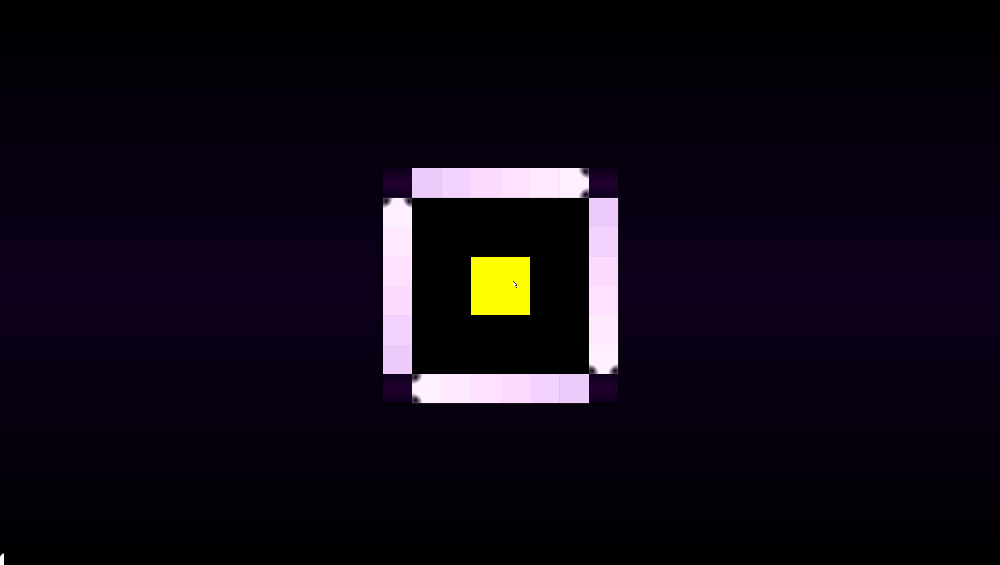

 

EKANS 
-----
EKANS is my simple implementation of the classic [Snake game](https://en.wikipedia.org/wiki/Snake_(video_game_genre)). There is a snake and there is food. Get the food, your snake grows, the head of the snake has to be inbound and can't touch any of its body parts. Each food is worth one point. Points are not saved.

Goals
-----
I set forth to accomplish <s>four</s> three things...

1. Get familiar with JavaFX again following MVVM design pattern.
2. Instead of drawing everything. I wanted to solve this with using nodes only (so no Canvas). I regret accomplishing (just made things way harder than they needed to be).
3. <s>Fix size everything and try using FXML</s>
4. Make it some what pretty

As you can see it went according to plan 100%.

Who plays EKANS?
------------
* cool kids
* me

Features
---------
* Ability to move snake using UP DOWN RIGHT LEFT
* System keeps track of score (length of the snake)
* Que up valid moves ahead of time to make handling the snake more intuitive.

Installation
------------
Download Java 14
Download EKANS jar 
Download bat file or... 
create a bat file named whatever you want
enter...

	@echo off
	PATH_TO_JAVA_14_EXE -jar ekans-1.0-SNAPSHOT-exec.jar
	pause

I might make this easier by wrapping jar into native runnable so to by pass downloading 14 and bat file but for now this is the way...

You can also fork my project, for your run configuration you will need to add this to VM arguements....

	--module-path C:\Java\javafx-sdk-14\lib --add-modules javafx.controls,javafx.base,javafx.fxml --add-exports javafx.graphics/com.sun.javafx.sg.prism=ALL-UNNAMED

Game Play
---------

Tips
----
* Paint or have nodes unmanaged to make things easier
* Use fixed sizes for things and rather scale whole project together than individually
* I liked move que however it may need more work to allow buttons being held down while pressing others
* Snake body parts implementation is not efficient but I did find it elegant on how I updated body parts
* Grid system that doesn't relate directly to view I enjoyed